# Architecture Guide

This document provides a comprehensive overview of the Local-First Chat Forge architecture, including system design, data flow, and component interactions.

## 🏗️ System Overview

The application follows a **local-first architecture** with the following key principles:

1. **Local data as the primary source of truth**
2. **Immediate UI updates from local storage**
3. **Background synchronization with conflict resolution**
4. **Offline-first operation with online enhancement**

## 📊 High-Level Architecture

## 🔄 Data Flow Architecture

## 📁 Layer Architecture

### 1. Presentation Layer
**Location**: `src/components/`

- **React Components**: UI components built with shadcn-ui
- **State Management**: React hooks and context
- **Real-time Updates**: Live UI updates from local data

### 2. Business Logic Layer
**Location**: `src/lib/`

- **Conversation Manager**: High-level business operations
- **AI Service**: AI response generation and caching
- **Database**: Local storage and search functionality
- **Sync Engine**: Cloud synchronization with conflict resolution

```mermaid
graph TB
    subgraph "Business Logic Layer"
        ConvManager[Conversation Manager<br/>• Create/update conversations<br/>• Message handling<br/>• Cache management]
        
        AIService[AI Service<br/>• Response generation<br/>• Streaming support<br/>• Response caching<br/>• Error handling]
        
        Database[Database Layer<br/>• IndexedDB operations<br/>• Full-text search<br/>• Data modeling<br/>• Search indexing]
        
        SyncEngine[Sync Engine<br/>• Background synchronization<br/>• Conflict resolution<br/>• Retry mechanisms<br/>• Network handling]
    end
    
    ConvManager --> Database
    ConvManager --> AIService
    ConvManager --> SyncEngine
    SyncEngine --> Database
    
    style ConvManager fill:#e1f5fe
    style AIService fill:#fff3e0
    style Database fill:#f3e5f5
    style SyncEngine fill:#e8f5e8
```

### 3. Data Layer

#### Local Storage Schema

#### Cloud Storage Schema (Supabase)

## 🔄 Synchronization Architecture

### Sync Strategy

### Conflict Resolution Flow

## 🤖 AI Integration Architecture

### AI Response Flow

### AI Service Architecture

```mermaid
graph TB
    subgraph "AI Service"
        RequestHandler[Request Handler<br/>• Message formatting<br/>• API key management<br/>• Error handling]
        
        StreamProcessor[Stream Processor<br/>• Token parsing<br/>• Real-time updates<br/>• Completion detection]
        
        CacheManager[Cache Manager<br/>• Response caching<br/>• LRU eviction<br/>• Cache invalidation]
        
        ErrorHandler[Error Handler<br/>• Retry logic<br/>• Timeout handling<br/>• Fallback responses]
    end
    
    RequestHandler --> StreamProcessor
    RequestHandler --> CacheManager
    RequestHandler --> ErrorHandler
    StreamProcessor --> CacheManager
    
    style RequestHandler fill:#e3f2fd
    style StreamProcessor fill:#e8f5e8
    style CacheManager fill:#fff3e0
    style ErrorHandler fill:#ffebee
```

## 🔍 Search Architecture

### Full-Text Search Implementation

```mermaid
graph LR
    subgraph "Search System"
        Input[User Query] --> Tokenizer[Tokenizer<br/>• Word extraction<br/>• Normalization<br/>• Stop words]
        
        Tokenizer --> SearchEngine[MiniSearch Engine<br/>• Fuzzy matching<br/>• Prefix search<br/>• Scoring]
        
        SearchEngine --> Results[Results<br/>• Relevance scoring<br/>• Highlighting<br/>• Pagination]
        
        subgraph "Index"
            MessageIndex[Message Index<br/>• Content tokens<br/>• Conversation mapping<br/>• Metadata]
        end
        
        SearchEngine <--> MessageIndex
    end
    
    style Input fill:#e1f5fe
    style SearchEngine fill:#e8f5e8
    style Results fill:#fff3e0
    style MessageIndex fill:#f3e5f5
```

## 🔧 Component Interaction Patterns

### State Management Pattern

### Error Handling Strategy

```mermaid
flowchart TD
    Error[Error Occurs] --> Type{Error Type}
    
    Type -->|Network| NetworkHandler[Network Error Handler<br/>• Queue for retry<br/>• Show offline mode<br/>• Continue locally]
    
    Type -->|AI API| AIHandler[AI Error Handler<br/>• Retry with backoff<br/>• Fallback response<br/>• User notification]
    
    Type -->|Database| DBHandler[Database Error Handler<br/>• Transaction rollback<br/>• Data recovery<br/>• Cache invalidation]
    
    Type -->|Sync| SyncHandler[Sync Error Handler<br/>• Conflict resolution<br/>• Manual intervention<br/>• Data integrity check]
    
    NetworkHandler --> Recover[Attempt Recovery]
    AIHandler --> Recover
    DBHandler --> Recover
    SyncHandler --> Recover
    
    Recover --> Success{Success?}
    Success -->|Yes| Continue[Continue Operation]
    Success -->|No| UserNotify[Notify User]
    
    style Error fill:#ffcdd2
    style Recover fill:#fff3e0
    style Continue fill:#c8e6c9
    style UserNotify fill:#ffe0b2
```

## 📱 Responsive Design Architecture

The UI adapts to different screen sizes using a responsive sidebar pattern:

```mermaid
graph LR
    subgraph "Desktop Layout"
        DSidebar[Sidebar<br/>Always Visible]
        DMain[Main Chat<br/>Full Width]
    end
    
    subgraph "Mobile Layout"
        MDrawer[Drawer Sidebar<br/>Overlay]
        MMain[Main Chat<br/>Full Screen]
    end
    
    BreakPoint{Screen Size} -->|≥768px| DSidebar
    BreakPoint -->|<768px| MDrawer
    
    style DSidebar fill:#e3f2fd
    style DMain fill:#e8f5e8
    style MDrawer fill:#fff3e0
    style MMain fill:#f3e5f5
```

## 🔐 Security Architecture

### Data Protection Layers

## 📈 Performance Considerations

### Optimization Strategies

1. **Local-First**: Immediate UI updates from local storage
2. **Caching**: Multiple cache layers for different data types
3. **Lazy Loading**: Components and data loaded on demand
4. **Search Indexing**: Pre-built search indices for fast queries
5. **Background Sync**: Non-blocking synchronization
6. **Virtual Scrolling**: Efficient rendering of large message lists

### Memory Management

This architecture provides a robust, scalable foundation for a local-first chat application with real-time synchronization and AI integration. 