# Component Guide

This document provides a comprehensive overview of the React component structure in the Local-First Chat Forge application.

## 📋 Table of Contents

1. [Component Hierarchy](#component-hierarchy)
2. [Chat Components](#chat-components)
3. [UI Components](#ui-components)
4. [Hooks](#hooks)
5. [Component Props](#component-props)
6. [State Management](#state-management)

## 🏗️ Component Hierarchy

```mermaid
graph TD
    App[App.tsx<br/>• Root component<br/>• Route configuration<br/>• Global providers]
    
    Index[Index.tsx<br/>• Main page<br/>• Simple wrapper]
    
    ChatInterface[ChatInterface.tsx<br/>• Main chat container<br/>• State management<br/>• Event handling]
    
    Sidebar[ConversationSidebar.tsx<br/>• Conversation list<br/>• Search functionality<br/>• Navigation]
    
    MessageList[MessageList.tsx<br/>• Message container<br/>• Virtual scrolling<br/>• Auto-scroll]
    
    MessageItem[MessageItem.tsx<br/>• Individual message<br/>• Role-based styling<br/>• Content rendering]
    
    ChatInput[ChatInput.tsx<br/>• Message input<br/>• Send functionality<br/>• Keyboard handling]
    
    UIComponents[UI Components<br/>• shadcn-ui based<br/>• Reusable primitives<br/>• Consistent styling]
    
    App --> Index
    Index --> ChatInterface
    ChatInterface --> Sidebar
    ChatInterface --> MessageList
    ChatInterface --> ChatInput
    MessageList --> MessageItem
    ChatInterface --> UIComponents
    Sidebar --> UIComponents
    MessageItem --> UIComponents
    ChatInput --> UIComponents
    
    style App fill:#e3f2fd
    style ChatInterface fill:#e8f5e8
    style Sidebar fill:#fff3e0
    style MessageList fill:#f3e5f5
    style UIComponents fill:#fce4ec
```



## 🗣️ Chat Components

### ChatInterface.tsx

The main orchestrator component that manages the entire chat experience.

**Location**: `src/components/chat/ChatInterface.tsx`

#### Responsibilities
- **State Management**: Manages conversations, messages, and UI state
- **Event Coordination**: Handles user interactions and system events
- **Network Awareness**: Monitors online/offline status
- **Sync Status**: Displays synchronization status
- **Layout Management**: Coordinates sidebar and main chat area

#### Key State
```typescript
const [conversations, setConversations] = useState<Conversation[]>([]);
const [activeConversationId, setActiveConversationId] = useState<string | null>(null);
const [messages, setMessages] = useState<Message[]>([]);
const [isLoading, setIsLoading] = useState(false);
const [streamContent, setStreamContent] = useState('');
const [isOnline, setIsOnline] = useState(navigator.onLine);
```

#### Key Methods
```typescript
// Conversation management
const handleCreateConversation = async () => Promise<void>;
const handleSelectConversation = (conversationId: string) => void;
const handleDeleteConversation = (conversationId: string) => Promise<void>;
const handleRenameConversation = (conversationId: string, newTitle: string) => Promise<void>;

// Message handling
const handleSendMessage = async (content: string) => Promise<void>;

// Sync operations
const handleForceSync = async () => Promise<void>;
```

#### Component Structure

```mermaid
graph LR
    subgraph "ChatInterface Layout"
        NetworkStatus[Network Status<br/>• Online indicator<br/>• Sync status<br/>• Force sync button]
        
        SidebarSection[Sidebar Section<br/>• Conversation list<br/>• Search bar<br/>• Create button]
        
        MainSection[Main Section<br/>• Message list<br/>• Chat input<br/>• Loading states]
    end
    
    ChatInterface --> NetworkStatus
    ChatInterface --> SidebarSection
    ChatInterface --> MainSection
    
    style NetworkStatus fill:#ffebee
    style SidebarSection fill:#e8f5e8
    style MainSection fill:#e3f2fd
```


---

### ConversationSidebar.tsx

Manages the conversation list and navigation.

**Location**: `src/components/chat/ConversationSidebar.tsx`

#### Responsibilities
- **Conversation List**: Displays all user conversations
- **Search Functionality**: Allows searching through conversations
- **Navigation**: Handles conversation selection
- **Actions**: Create, rename, delete conversations
- **Responsive Design**: Adapts to different screen sizes

#### Props Interface
```typescript
interface ConversationSidebarProps {
  conversations: Conversation[];
  activeConversationId: string | null;
  onSelectConversation: (conversationId: string) => void;
  onCreateConversation: () => void;
  onDeleteConversation: (conversationId: string) => void;
  onRenameConversation: (conversationId: string, newTitle: string) => void;
  onSearch: (query: string) => void;
  isLoading?: boolean;
}
```

#### Features
- ✅ **Search**: Real-time conversation filtering
- ✅ **Context Menu**: Right-click actions (rename, delete)
- ✅ **Keyboard Navigation**: Arrow keys and Enter
- ✅ **Responsive**: Drawer on mobile, sidebar on desktop
- ✅ **Visual Indicators**: Active conversation highlighting

#### Responsive Behavior

```mermaid
graph LR
    subgraph "Desktop (≥768px)"
        DesktopSidebar[Fixed Sidebar<br/>• Always visible<br/>• 300px width<br/>• Resizable]
    end
    
    subgraph "Mobile (<768px)"
        MobileDrawer[Drawer Overlay<br/>• Slide-in animation<br/>• Full-screen overlay<br/>• Touch gestures]
    end
    
    BreakPoint{Screen Size} -->|≥768px| DesktopSidebar
    BreakPoint -->|<768px| MobileDrawer
    
    style DesktopSidebar fill:#e3f2fd
    style MobileDrawer fill:#fff3e0
```


---

### MessageList.tsx

Renders the list of messages with performance optimizations.

**Location**: `src/components/chat/MessageList.tsx`

#### Responsibilities
- **Message Rendering**: Displays conversation messages
- **Auto-scrolling**: Scrolls to new messages automatically
- **Performance**: Handles large message lists efficiently
- **Loading States**: Shows loading and streaming indicators

#### Props Interface
```typescript
interface MessageListProps {
  messages: Message[];
  streamingMessage?: Message | null;
  streamContent?: string;
  isLoading?: boolean;
  conversationId?: string;
}

interface MessageListRef {
  scrollToBottom: () => void;
  scrollToMessage: (messageId: string) => void;
}
```

#### Key Features
- ✅ **Virtual Scrolling**: Efficient rendering of large lists
- ✅ **Auto-scroll**: Automatically scrolls to new messages
- ✅ **Smooth Scrolling**: Animated scroll transitions
- ✅ **Streaming Support**: Real-time message updates
- ✅ **Message Grouping**: Groups consecutive messages by role

#### Scroll Behavior
```typescript
// Auto-scroll logic
useEffect(() => {
  if (streamingMessage || (messages.length > 0 && isNewMessage)) {
    scrollToBottom();
  }
}, [messages, streamingMessage, streamContent]);

const scrollToBottom = useCallback(() => {
  if (messagesEndRef.current) {
    messagesEndRef.current.scrollIntoView({ 
      behavior: 'smooth',
      block: 'end'
    });
  }
}, []);
```

---

### MessageItem.tsx

Renders individual message components with role-specific styling.

**Location**: `src/components/chat/MessageItem.tsx`

#### Responsibilities
- **Message Display**: Renders message content
- **Role Styling**: Different styles for user/assistant messages
- **Timestamp**: Shows message timestamps
- **Content Formatting**: Handles text formatting and links

#### Props Interface
```typescript
interface MessageItemProps {
  message: Message;
  isStreaming?: boolean;
  streamContent?: string;
  isLastMessage?: boolean;
}
```

#### Message Types

```mermaid
graph LR
    subgraph "Message Variants"
        UserMessage[User Message<br/>• Right-aligned<br/>• Blue background<br/>• User avatar]
        
        AssistantMessage[AI Message<br/>• Left-aligned<br/>• Gray background<br/>• AI avatar]
        
        StreamingMessage[Streaming Message<br/>• Typing indicator<br/>• Real-time updates<br/>• Cursor animation]
        
        ErrorMessage[Error Message<br/>• Red styling<br/>• Error icon<br/>• Retry option]
    end
    
    MessageItem --> UserMessage
    MessageItem --> AssistantMessage
    MessageItem --> StreamingMessage
    MessageItem --> ErrorMessage
    
    style UserMessage fill:#e3f2fd
    style AssistantMessage fill:#e8f5e8
    style StreamingMessage fill:#fff3e0
    style ErrorMessage fill:#ffebee
```


#### Styling Example
```typescript
const messageVariants = {
  user: "ml-auto bg-primary text-primary-foreground",
  assistant: "mr-auto bg-muted",
  streaming: "mr-auto bg-muted animate-pulse",
  error: "mr-auto bg-destructive/10 border-destructive"
};
```

---

### ChatInput.tsx

Handles message input with enhanced UX features.

**Location**: `src/components/chat/ChatInput.tsx`

#### Responsibilities
- **Text Input**: Multi-line message input
- **Send Functionality**: Message submission
- **Keyboard Shortcuts**: Enter to send, Shift+Enter for new line
- **Loading States**: Disabled during AI response generation

#### Props Interface
```typescript
interface ChatInputProps {
  onSendMessage: (content: string) => Promise<void>;
  isLoading?: boolean;
  disabled?: boolean;
  placeholder?: string;
}
```

#### Features
- ✅ **Auto-resize**: Textarea grows with content
- ✅ **Keyboard Shortcuts**: 
  - `Enter`: Send message
  - `Shift + Enter`: New line
  - `Ctrl/Cmd + Enter`: Force send
- ✅ **Character Counter**: Shows message length
- ✅ **Send Button**: Click to send or disabled state
- ✅ **Paste Support**: Handles text pasting

#### Input Behavior
```typescript
const handleKeyDown = (e: KeyboardEvent<HTMLTextAreaElement>) => {
  if (e.key === 'Enter' && !e.shiftKey && !e.ctrlKey && !e.metaKey) {
    e.preventDefault();
    if (inputValue.trim() && !isLoading) {
      handleSend();
    }
  }
};

const handleSend = async () => {
  if (!inputValue.trim() || isLoading) return;
  
  const content = inputValue.trim();
  setInputValue('');
  await onSendMessage(content);
};
```

## 🎨 UI Components

The application uses **shadcn-ui** components for consistent, accessible UI elements.

### Component Library Structure

```mermaid
graph TB
    subgraph "Core UI Components"
        Button[Button<br/>• Primary/Secondary<br/>• Loading states<br/>• Icon variants]
        
        Input[Input<br/>• Text/Search<br/>• Validation states<br/>• Accessibility]
        
        Dialog[Dialog<br/>• Modal dialogs<br/>• Form dialogs<br/>• Confirmation]
        
        Card[Card<br/>• Message containers<br/>• Conversation items<br/>• Status panels]
    end
    
    subgraph "Layout Components"
        Sidebar[Sidebar<br/>• Navigation<br/>• Collapsible<br/>• Responsive]
        
        ScrollArea[Scroll Area<br/>• Custom scrollbars<br/>• Smooth scrolling<br/>• Touch support]
        
        Separator[Separator<br/>• Visual dividers<br/>• Spacing control]
        
        Sheet[Sheet<br/>• Mobile drawer<br/>• Slide animations<br/>• Backdrop]
    end
    
    subgraph "Feedback Components"
        Toast[Toast<br/>• Notifications<br/>• Success/Error<br/>• Auto-dismiss]
        
        Alert[Alert<br/>• Status messages<br/>• Warning states<br/>• Info panels]
        
        Skeleton[Skeleton<br/>• Loading states<br/>• Content placeholders]
        
        Badge[Badge<br/>• Status indicators<br/>• Count badges<br/>• Color variants]
    end
    
    style Button fill:#e3f2fd
    style Sidebar fill:#e8f5e8
    style Toast fill:#fff3e0
```



### Key UI Components

#### Button Component
```typescript
interface ButtonProps {
  variant?: "default" | "destructive" | "outline" | "secondary" | "ghost" | "link";
  size?: "default" | "sm" | "lg" | "icon";
  loading?: boolean;
  disabled?: boolean;
  children: React.ReactNode;
}

// Usage examples
<Button onClick={handleSend} loading={isLoading}>
  Send Message
</Button>

<Button variant="outline" size="sm" onClick={handleEdit}>
  <Edit className="w-4 h-4" />
</Button>
```

#### Dialog Component
```typescript
// Confirmation dialog
<AlertDialog>
  <AlertDialogTrigger asChild>
    <Button variant="destructive">Delete</Button>
  </AlertDialogTrigger>
  <AlertDialogContent>
    <AlertDialogHeader>
      <AlertDialogTitle>Delete Conversation</AlertDialogTitle>
      <AlertDialogDescription>
        This action cannot be undone.
      </AlertDialogDescription>
    </AlertDialogHeader>
    <AlertDialogFooter>
      <AlertDialogCancel>Cancel</AlertDialogCancel>
      <AlertDialogAction onClick={handleDelete}>
        Delete
      </AlertDialogAction>
    </AlertDialogFooter>
  </AlertDialogContent>
</AlertDialog>
```

## 🎣 Hooks

### Custom Hooks

#### useToast
```typescript
// Toast notifications
const { toast } = useToast();

toast({
  title: "Success",
  description: "Message sent successfully",
  variant: "default"
});

toast({
  title: "Error",
  description: "Failed to send message",
  variant: "destructive"
});
```

#### useMobile
```typescript
// Responsive design helper
const isMobile = useMobile();

return (
  <>
    {isMobile ? (
      <Sheet>
        <ConversationSidebar />
      </Sheet>
    ) : (
      <div className="w-80">
        <ConversationSidebar />
      </div>
    )}
  </>
);
```

## 📊 State Management

### State Flow Diagram


### Context and State Patterns

#### Local State Management
```typescript
// Component-level state
const [conversations, setConversations] = useState<Conversation[]>([]);
const [messages, setMessages] = useState<Message[]>([]);
const [isLoading, setIsLoading] = useState(false);

// Effect for loading data
useEffect(() => {
  const loadConversations = async () => {
    setIsLoading(true);
    try {
      const convs = await conversationManager.getConversations();
      setConversations(convs);
    } catch (error) {
      toast({ title: "Error", description: "Failed to load conversations" });
    } finally {
      setIsLoading(false);
    }
  };
  
  loadConversations();
}, []);
```

#### Service Integration
```typescript
// Service layer integration
const handleSendMessage = useCallback(async (content: string) => {
  if (!activeConversationId) return;
  
  setIsLoading(true);
  setStreamContent('');
  
  try {
    const { userMessage, aiMessage } = await conversationManager.sendMessage(
      activeConversationId,
      content,
      (token) => {
        setStreamContent(prev => prev + token);
      }
    );
    
    // Update local state
    setMessages(prev => [...prev, userMessage, aiMessage]);
    
    // Update conversation list
    setConversations(prev => 
      prev.map(conv => 
        conv.id === activeConversationId 
          ? { ...conv, updatedAt: Date.now() }
          : conv
      )
    );
  } catch (error) {
    toast({ 
      title: "Error", 
      description: "Failed to send message",
      variant: "destructive"
    });
  } finally {
    setIsLoading(false);
    setStreamContent('');
  }
}, [activeConversationId, toast]);
```

## 🔧 Component Best Practices

### Performance Optimizations

1. **React.memo**: Prevent unnecessary re-renders
```typescript
export const MessageItem = React.memo<MessageItemProps>(({ message, isStreaming }) => {
  // Component implementation
});
```

2. **useCallback**: Memoize event handlers
```typescript
const handleSelectConversation = useCallback((conversationId: string) => {
  setActiveConversationId(conversationId);
}, []);
```

3. **useMemo**: Memoize expensive calculations
```typescript
const sortedConversations = useMemo(() => 
  conversations.sort((a, b) => b.updatedAt - a.updatedAt),
  [conversations]
);
```

### Accessibility

- **Keyboard Navigation**: All interactive elements are keyboard accessible
- **ARIA Labels**: Proper labeling for screen readers
- **Focus Management**: Logical focus flow and trap
- **Color Contrast**: Meets WCAG guidelines
- **Semantic HTML**: Proper heading hierarchy and landmarks

### Error Boundaries

```typescript
class ChatErrorBoundary extends React.Component {
  constructor(props) {
    super(props);
    this.state = { hasError: false };
  }

  static getDerivedStateFromError(error) {
    return { hasError: true };
  }

  componentDidCatch(error, errorInfo) {
    console.error('Chat component error:', error, errorInfo);
  }

  render() {
    if (this.state.hasError) {
      return (
        <div className="flex items-center justify-center h-full">
          <Alert>
            <AlertTriangle className="h-4 w-4" />
            <AlertTitle>Something went wrong</AlertTitle>
            <AlertDescription>
              Please refresh the page to continue.
            </AlertDescription>
          </Alert>
        </div>
      );
    }

    return this.props.children;
  }
}
```

This component architecture provides a solid foundation for building scalable, maintainable chat interfaces with modern React patterns and practices. 