# Local-First Implementation Guide

This document details the local-first implementation strategies used in the Chat Forge application, including offline capabilities, data synchronization, and conflict resolution.

## 🎯 Local-First Principles

The application follows these core local-first principles:

1. **Local data is the primary source of truth**
2. **UI updates immediately from local storage**
3. **Network is an enhancement, not a requirement**
4. **Conflicts are resolved automatically when possible**
5. **Data integrity is maintained across all states**

## 📱 Offline-First Architecture

### Data Flow Strategy


## 🗄️ Local Storage Implementation

### IndexedDB with Dexie

The application uses **Dexie** as an IndexedDB wrapper for local storage:

```typescript
// Database Schema Definition
class ChatDatabase extends Dexie {
  conversations!: Dexie.Table<Conversation, string>;
  messages!: Dexie.Table<Message, string>;
  syncQueue!: Dexie.Table<SyncItem, number>;
  searchIndex!: Dexie.Table<SearchIndexItem, string>;

  constructor() {
    super('ChatbotDB');
    
    this.version(2).stores({
      conversations: 'id, updatedAt, syncStatus, user_id',
      messages: 'id, conversation_id, timestamp, syncStatus, [conversation_id+timestamp]',
      syncQueue: '++id, entityType, status, timestamp, nextRetry',
      searchIndex: 'id, conversation_id, *tokens'
    });
  }
}
```

### Data Models

#### Conversation Model
```typescript
interface Conversation {
  id: string;                    // UUID primary key
  title: string;                 // Conversation title
  user_id?: string;             // Owner user ID
  createdAt: number;            // Creation timestamp
  updatedAt: number;            // Last update timestamp
  syncStatus: 'synced' | 'pending' | 'conflict';
  vector: Record<string, number>; // Vector clock for conflict resolution
}
```

#### Message Model
```typescript
interface Message {
  id: string;                    // UUID primary key
  conversation_id: string;       // Foreign key to conversation
  role: 'user' | 'assistant';   // Message sender type
  content: string;               // Message content
  timestamp: number;             // Message timestamp
  syncStatus: 'synced' | 'pending' | 'conflict';
  vector: Record<string, number>; // Vector clock
}
```

#### Sync Queue Model
```typescript
interface SyncItem {
  id?: number;                   // Auto-increment primary key
  entityType: 'conversation' | 'message';
  operation: 'create' | 'update' | 'delete';
  entityId: string;              // ID of the entity to sync
  payload?: any;                 // Entity data for create/update
  status: 'pending' | 'processing' | 'failed';
  timestamp: number;             // When sync was queued
  retries: number;               // Number of retry attempts
  nextRetry?: number;            // Next retry timestamp
}
```

## 🔄 Synchronization Engine

### Sync Strategy Overview


### Sync Queue Management

#### Adding Items to Sync Queue
```typescript
async addToSyncQueue(
  operation: 'create' | 'update' | 'delete',
  entityType: 'conversation' | 'message',
  entity: any
): Promise<void> {
  const syncItem: SyncItem = {
    entityType,
    operation,
    entityId: entity.id,
    payload: operation !== 'delete' ? entity : undefined,
    status: 'pending',
    timestamp: Date.now(),
    retries: 0
  };
  
  await db.syncQueue.add(syncItem);
}
```

#### Processing Sync Queue
```typescript
async processSyncQueue(): Promise<void> {
  const now = Date.now();
  
  // Get pending items, excluding those with future retry times
  const syncItems = await db.syncQueue
    .where('status')
    .equals('pending')
    .and(item => !item.nextRetry || item.nextRetry <= now)
    .limit(this.batchSize)
    .toArray();

  for (const item of syncItems) {
    try {
      await this.syncItem(item);
      await db.syncQueue.delete(item.id!);
    } catch (error) {
      await this.handleSyncError(item, error);
    }
  }
}
```

## ⚡ Conflict Resolution

### Vector Clock Implementation

Each device maintains a logical clock that increments with each change:

```typescript
const localDeviceId = localStorage.getItem('deviceId') || uuidv4();

// When creating/updating entities
const entity = {
  id: 'some-id',
  content: 'updated content',
  vector: { [localDeviceId]: Date.now() },
  // ... other fields
};
```

### Conflict Resolution Algorithm


#### Conflict Resolution Implementation
```typescript
private resolveConflict(local: any, remote: any): any {
  const localVector = local.vector || {};
  const remoteVector = remote.vector || {};
  
  // Compare vector clocks
  const localTime = Math.max(...Object.values(localVector));
  const remoteTime = Math.max(...Object.values(remoteVector));
  
  if (localTime > remoteTime) {
    return local; // Local is newer
  } else if (remoteTime > localTime) {
    return remote; // Remote is newer
  } else {
    // Concurrent edits - use last-write-wins with device priority
    const localDeviceTime = localVector[localDeviceId] || 0;
    const remoteDeviceTime = remoteVector[Object.keys(remoteVector)[0]] || 0;
    
    return localDeviceTime >= remoteDeviceTime ? local : remote;
  }
}
```

## 🔍 Search Implementation

### Local Full-Text Search

Uses **MiniSearch** for client-side full-text search:

```typescript
class ChatDatabase extends Dexie {
  private searchEngine: MiniSearch;

  constructor() {
    super('ChatbotDB');
    
    // Initialize search engine
    this.searchEngine = new MiniSearch({
      fields: ['content'],
      storeFields: ['id', 'conversation_id', 'role', 'timestamp'],
      tokenize: text => text.toLowerCase().match(/\w+/g) || [],
      processTerm: term => term.toLowerCase()
    });
  }

  async addMessageToSearch(message: Message) {
    this.searchEngine.add({
      id: message.id,
      conversation_id: message.conversation_id,
      content: message.content,
      role: message.role,
      timestamp: message.timestamp
    });

    // Also store in IndexedDB for persistence
    await this.searchIndex.put({
      id: message.id,
      conversation_id: message.conversation_id,
      tokens: this.tokenize(message.content)
    });
  }
}
```

### Search Features


## 🌐 Network Awareness

### Network State Management

```typescript
class SyncEngine {
  private isOnline = navigator.onLine;

  constructor() {
    this.initNetworkListeners();
  }

  private initNetworkListeners() {
    window.addEventListener('online', () => {
      console.log('Network: Online');
      this.isOnline = true;
      this.processSyncQueue(); // Immediately process pending syncs
    });
    
    window.addEventListener('offline', () => {
      console.log('Network: Offline');
      this.isOnline = false;
    });
  }
}
```

### Graceful Degradation

```mermaid
graph TD
    AppStart[Application Start] --> CheckNetwork{Network Available?}
    
    CheckNetwork -->|Yes| OnlineMode[Online Mode<br/>• Full sync capabilities<br/>• Real-time updates<br/>• Cloud backup]
    
    CheckNetwork -->|No| OfflineMode[Offline Mode<br/>• Local-only operations<br/>• Queue sync operations<br/>• Show offline indicator]
    
    OnlineMode --> NetworkLoss{Network Lost?}
    NetworkLoss -->|Yes| GracefulDegradation[Graceful Degradation<br/>• Continue current operations<br/>• Queue new changes<br/>• Update UI indicators]
    
    OfflineMode --> NetworkRestore{Network Restored?}
    NetworkRestore -->|Yes| SyncProcess[Sync Process<br/>• Process sync queue<br/>• Resolve conflicts<br/>• Update UI status]
    
    GracefulDegradation --> OfflineMode
    SyncProcess --> OnlineMode
    
    style OnlineMode fill:#c8e6c9
    style OfflineMode fill:#ffcdd2
    style GracefulDegradation fill:#fff3e0
    style SyncProcess fill:#e1f5fe
```



## 🛡️ Data Integrity

### Transaction Management

All local operations use IndexedDB transactions:

```typescript
async sendMessage(conversationId: string, content: string): Promise<void> {
  await db.transaction('rw', [db.messages, db.conversations, db.syncQueue], async () => {
    // Create user message
    const userMessage = this.createMessage(conversationId, content, 'user');
    await db.messages.add(userMessage);
    
    // Update conversation timestamp
    await db.conversations.update(conversationId, {
      updatedAt: Date.now(),
      syncStatus: 'pending'
    });
    
    // Add to sync queue
    await this.addToSyncQueue('create', 'message', userMessage);
  });
}
```

### Data Validation

```typescript
interface ValidationRule<T> {
  field: keyof T;
  validator: (value: any) => boolean;
  message: string;
}

const messageValidationRules: ValidationRule<Message>[] = [
  {
    field: 'content',
    validator: (value) => typeof value === 'string' && value.length > 0,
    message: 'Message content is required'
  },
  {
    field: 'role',
    validator: (value) => ['user', 'assistant'].includes(value),
    message: 'Invalid message role'
  }
];

function validateEntity<T>(entity: T, rules: ValidationRule<T>[]): string[] {
  const errors: string[] = [];
  
  for (const rule of rules) {
    if (!rule.validator(entity[rule.field])) {
      errors.push(rule.message);
    }
  }
  
  return errors;
}
```

## 📊 Performance Optimizations

### Caching Strategy

```mermaid
graph TB
    subgraph "Multi-Level Caching"
        L1Cache[L1: React State<br/>• Current conversation<br/>• Active messages<br/>• Immediate updates]
        
        L2Cache[L2: Service Cache<br/>• Recent conversations<br/>• Message history<br/>• Search results]
        
        L3Cache[L3: IndexedDB<br/>• All local data<br/>• Search indices<br/>• Sync queue]
        
        L4Cache[L4: Supabase<br/>• Cloud backup<br/>• Cross-device sync<br/>• Data recovery]
    end
    
    UserRequest[User Request] --> L1Cache
    L1Cache -->|Cache Miss| L2Cache
    L2Cache -->|Cache Miss| L3Cache
    L3Cache -->|Cache Miss| L4Cache
    
    L4Cache -->|Data| L3Cache
    L3Cache -->|Data| L2Cache
    L2Cache -->|Data| L1Cache
    L1Cache -->|Response| UserRequest
    
    style L1Cache fill:#ffebee
    style L2Cache fill:#fff3e0
    style L3Cache fill:#e8f5e8
    style L4Cache fill:#e3f2fd
```



### Background Processing

```typescript
class ConversationManager {
  private cache = new Map<string, Message[]>();
  private readonly MAX_CACHE_SIZE = 5;

  async getMessages(conversationId: string): Promise<Message[]> {
    // Cache-first strategy
    if (this.cache.has(conversationId)) {
      this.updateCacheOrder(conversationId);
      return this.cache.get(conversationId)!;
    }

    // Fetch from IndexedDB
    const messages = await db.messages
      .where('conversation_id')
      .equals(conversationId)
      .sortBy('timestamp');

    // Update cache with LRU eviction
    this.updateCache(conversationId, messages);
    
    return messages;
  }
}
```

## 🔧 Developer Tools

### Debug Information

```typescript
async getSyncStatus() {
  const pendingItems = await db.syncQueue
    .where('status')
    .equals('pending')
    .count();
    
  const failedItems = await db.syncQueue
    .where('status')
    .equals('failed')
    .count();
    
  return {
    isOnline: this.isOnline,
    pendingSync: pendingItems,
    failedSync: failedItems,
    lastSync: this.lastSyncTime,
    cacheSize: conversationManager.getCacheInfo()
  };
}
```

### Manual Sync Controls

```typescript
// Force immediate sync (useful for testing)
async forceSync(): Promise<void> {
  if (this.isOnline) {
    await this.processSyncQueue();
  }
}

// Clear local data (reset application)
async clearLocalData(): Promise<void> {
  await db.delete();
  await db.open();
  location.reload();
}
```

This local-first implementation ensures the application works seamlessly offline while providing robust synchronization when online, maintaining data integrity and user experience across all network conditions. 